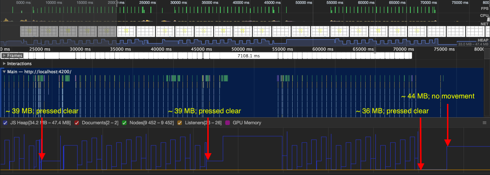
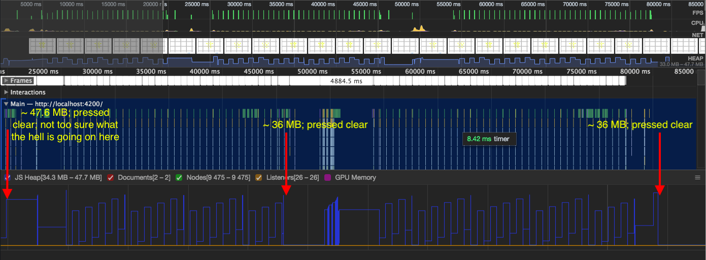

# game-of-life
Conway's Game of Life

https://wluu.github.io/game-of-life/

# My Notes

[States v2](https://drive.google.com/file/d/0B9DrOVKPxr98b2xfREU3VzB3ZzE4ZlQxNGFzMnBaaHBfeTNz/view?usp=sharing)

[Layout v2](https://drive.google.com/file/d/0B9DrOVKPxr98clZmVjl6dnRVZGxnc29SY19nYUtSQnFtVTY0/view?usp=sharing)

[High Level Rules](https://drive.google.com/file/d/0B9DrOVKPxr98VGVRQTRIV2hHLXEzNmpHRFVUd25HYlVackVV/view?usp=sharing)

# TODOs

Going to break this down into smaller chunks:

- [x] Make the board
  - [x] Forgot to add the borders to the board
- [x] Add event listeners to each cell in the board
  - Change color of any given cell when clicking on them
- [x] Work on game of life rules
  - [x] Add the life rules
  - [x] Mock the control to make sure the rules are correct
- [x] ~~Emit data to the board component~~ Get data from life service so we can actually update the board with new data
- [x] Will need to create some form of game loop so the cells appear to be moving
- [x] Create a class for the debugging logs and the debugging text on the board
- [x] Re-evaluate the state flows and layout design
- [x] Add the controls (minimalistic level)
  - [x] Added the basic layout
  - [x] Hook up the buttons to the board component
  - [x] Add the ability to click and hold to select the cells
    - [x] REFACTOR A BIT
  - [x] Properly disable and enable the control buttons
    - Including when all cells die
  - [x] Add the next button
  - [x] Found bug: if the board is empty by deselecting, the control states are not properly reflected; listen on mouseup and check board if there are any live cells
  - [x] Found bug: hold down on left click does not de-select cells; should do shift + mousedown
  - [x] Add the drop-down list to have initial seeds: blinker, pulsar, pentadecathlon, glider, and lightweight spaceship (from wiki)
    - Read up on https://angular.io/guide/forms
    - ~~Make sure it's properly disabled/enabled during the different states~~
- [x] Look into the cursor change bug
- [x] ~~Add the help icon~~ Add how-to guide at the bottom
- [x] Check performance/memory
  - There might be some memory leaks according to https://developers.google.com/web/tools/chrome-devtools/memory-problems/
  - But, it looks like the memory leaks for DOM nodes and JS heaps are growing at a slow rate; was monitoring Chrome's task manager.
    - Used Chrome's Performance tool to isolate the memory leaks.
    - But, was not able to isolate/discern the memory leak with Memory Heap snapshot and Memory Allocation instrumentation on timeline.
    - The **general** steps I used to find the memory leak:
      1. Loaded web app (locally)
      2. Used Pulsar as initial seed
      3. Clicked Play to allow the game to run
      4. Every 10 - 15 seconds, cleared the board with Clear button
      5. Repeated steps 2 to 4 three or four times
    - Based on the Performance tool, my guess was that the memory leak was occurring when I clear the board. Specifically in `ControlsComponent.onClickClear()`, which will call `BoardComponent.reset()`.
    - However, I remembered from the Angular documentation that it was good practice to only do simple initialization in the component's constructor. `BoardComponent.cellsStyle` and `TrackingService.board`, to a degree, were not simple initializations. They were large matrices that dynamically changed.
    - Putting those two properties in `ngOnInit()` ~~seemed to have solved the memory leak~~ didn't seem to do much.
      - In constructor: 
      - In `ngOnInit()`: 
    - Hmm, as long as it doesn't stutter, I think it's okay for now.
- [x] Need to make the web app dynamically proportional
  - ~~https://css-tricks.com/scaled-proportional-blocks-with-css-and-javascript/~~
  - ~~Can use the `transform: scale()` CSS property. It looks like it only works when `display: block`, which the body element is automatically set.~~
  - Hmm, `transform: scale()` doesn't seem to be the way. Can't figure out the correct scaling value.
  - But: https://alistapart.com/article/responsive-web-design
    - Yep, making a web app responsive is complicated. I've done as much as I can endure.
- [ ] Material design???
  - https://material.angular.io/guides
  - Another time ...
